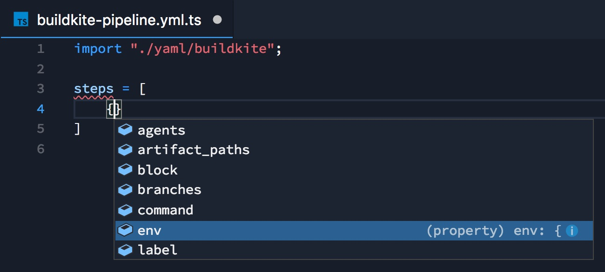

# ts-yaml

YAML is awesome!

* Easy to learn.
* Minimal syntax.

But it has some drawbacks, especially as YAML files scale.

* No types/code completion.
* Ambiguous syntax.
* No control flow (e.g. ternary operator, functions, `map`).

This is an experiment to define types for YAML in TypeScript, with the goal of easily generating typechecked YAML.

## Examples

### Buildkite pipleines

Here's a sample `pipelines.yml` file for Buildkite CI:

```yaml
steps:
  - command: "FIXTURE=cplusplus,schema-cplusplus,kotlin,graphql .buildkite/build-pr.sh"
    label: "C++ Kotlin GraphQL"

  - command: "FIXTURE=java,schema-java,schema-json-csharp .buildkite/build-pr.sh"
    label: "java schema-json-c#"

  - command: "FIXTURE=typescript,schema-typescript,javascript,schema-javascript,flow,schema-flow,json-ts-csharp .buildkite/build-pr.sh"
    label: "typescript javascript flow"

  - command: "FIXTURE=swift,schema-swift,rust,schema-rust,elm,schema-elm .buildkite/build-pr.sh"
    label: "swift rust elm"

  - command: "FIXTURE=csharp,schema-csharp,ruby,schema-ruby,golang,schema-golang .buildkite/build-pr.sh"
    label: "csharp ruby golang"
```

Let's write the type of the YAML in TypeScript. Immediately we have a lot more information than is evident in the YAML sample:

```typescript
interface Step {
  command: string | string[];
  label?: string;
  branches?: string;
  env?: { [name: string]: string };
  agents?: { [key: string]: string };
  artifact_paths?: string;
  parallelism?: number;
  concurrency?: number;
  concurrency_group?: string;
  timeout_in_minutes?: number;
  skip?: boolean | string;
  retry?:
    | { automatic: boolean | AutomaticRetryConditions }
    | { manual: boolean | ManualRetryConditions };
}

interface AutomaticRetryConditions {
  exit_status?: "*" | number;
  limit?: 1 | 2 | 3 | 4 | 5 | 6 | 7 | 8 | 9 | 10;
}

interface ManualRetryConditions {
  allowed?: boolean;
  reason?: string;
  permit_on_pass?: boolean;
}

declare var steps: Step[];
```

Let's make a file named `pipeline.yml.ts` and define the `steps` global variable, and we immediately get code completion where we would otherwise have to search Buildkite's docs:



We can finish defining our CI steps:

```typescript
import "yaml/buildkite";

const fixtures = [
  "cplusplus,schema-cplusplus,kotlin,graphql",
  "java,schema-java,schema-json-csharp",
  "typescript,schema-typescript,javascript,schema-javascript,flow,schema-flow,json-ts-csharp",
  "swift,schema-swift,rust,schema-rust,elm,schema-elm",
  "csharp,schema-csharp,ruby,schema-ruby,golang,schema-golang"
];

steps = fixtures.map(fixture => ({
  command: `FIXTURE=${fixture} .buildkite/build-pr.sh`,
  label: fixture
}));
```

Using:

* `steps` is typechecked
* String interpolation
* Data (list of fixtures)
* `map`

Output YAML with `ts-yaml pipeline.yaml.ts`.
